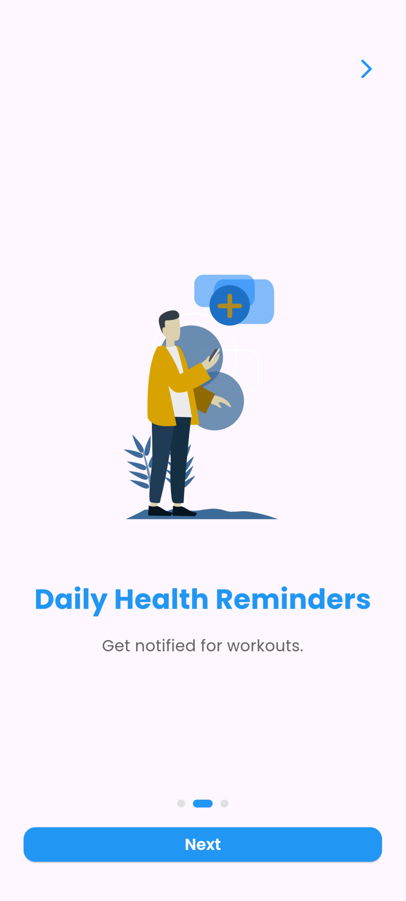
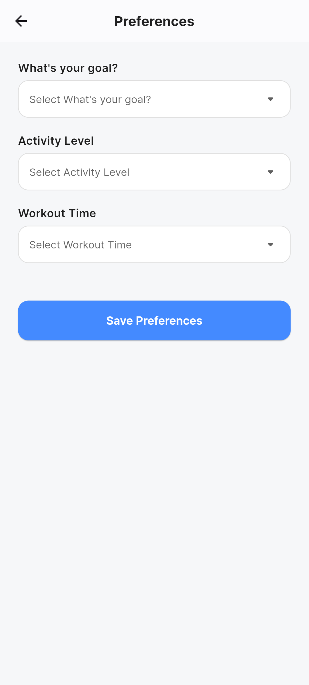
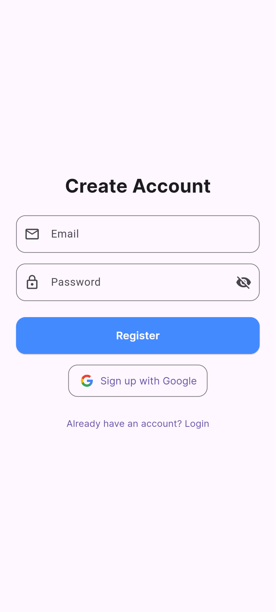
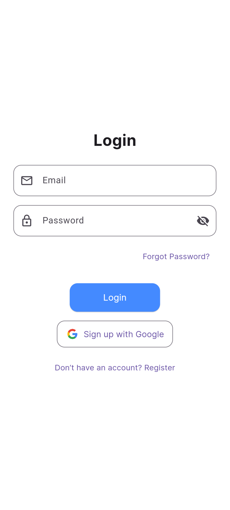
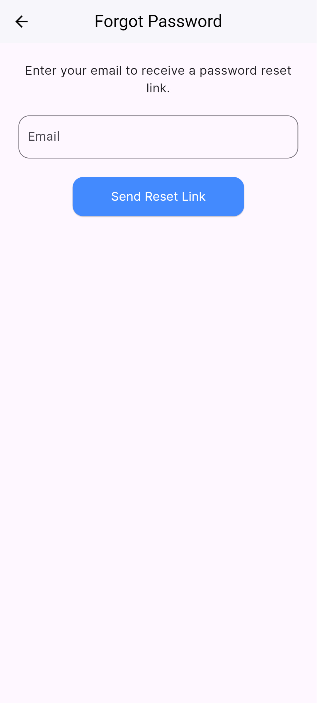
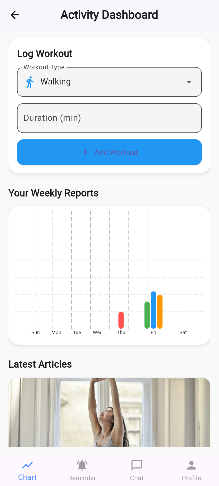
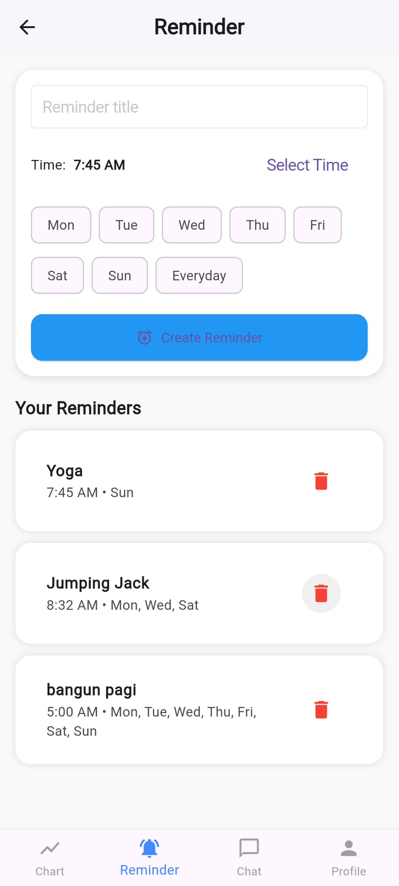
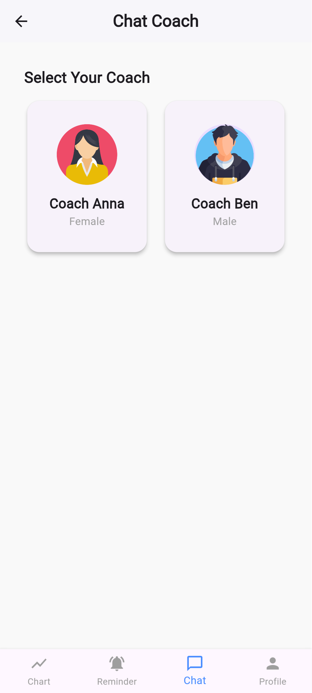
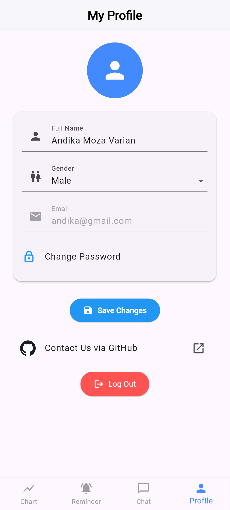

# 🏋️‍♂️ FitTrack – Aplikasi Pelacak Kebugaran

## 📌 Deskripsi Singkat
**FitTrack** adalah aplikasi yang dirancang untuk membantu pengguna melacak kebugaran dan gaya hidup sehat. FitTrack menyediakan fitur seperti pengingat aktivitas, grafik kalori, chat dengan pelatih, dan artikel kesehatan. Aplikasi ini memiliki antarmuka modern bergaya iOS dan menggunakan Firebase untuk autentikasi dan penyimpanan data.

---

## 🚀 Fitur Utama
- ✅ Onboarding dengan animasi lottie yang menarik
- ✅ Preference screen untuk menentukan tujuan kesehatan
- ✅ Login & Register menggunakan Firebase Auth
- ✅ Main Screen dengan navigasi bawah (Bottom Navigation Bar)
- ✅ Dashboard berisi grafik aktivitas dan artikel dari Firestore
- ✅ Reminder Screen: Tambah dan hapus pengingat dengan waktu dan hari
- ✅ Chat Screen: Chat dengan pelatih (auto-reply dan simpan chat ke Firestore)
- ✅ Profile Screen: Menampilkan info pengguna dan disimpan di Firestore

---

## 🧰 Teknologi yang Digunakan
- ✅ **Flutter**
- ✅ **Shared Preferences**  
  Menyimpan tema aplikasi
- ✅ **Firebase Authentication**  
  Untuk login dan register
- ✅ **Cloud Firestore**  
  Menyimpan reminder, artikel, riwayat chat, dan profile pengguna
- ✅ **Lottie & Flutter Animation**  
  Digunakan pada onboarding dan transisi antar halaman

---

## 📸 Screenshot Aplikasi














---

## 🚀 Cara Menjalankan

1. Clone repositori ini  `https://github.com/andikamoza/uas-fittrack.git`
2. Ubah direktori `cd uas-fittrack`
3. Jalankan `flutter pub get`
4. Jalankan aplikasi: `flutter run -d chrome` atau emulator/device lain

---


## 🧑‍💻 Kontributor

- **Nama     : Andika Moza Varian**
- **NPM      : 2022804134**
- **Prodi    : Sistem Informasi**
- **Semester : 6A Pagi**

---


## 📁 Struktur Folder (Ringkasan)
```bash
lib/
├── main.dart
├── firebase_options.dart
├── utils/
│   ├── app_theme.dart
│   ├── constants.dart
│   └── theme_provider.dart
├── services/
│   ├── auth_service.dart
│   ├── firestore_service.dart
│   └── preference_service.dart
├── screens/
│   ├── onboarding/
│   │   └── onboarding_screen.dart
│   ├── auth/
│   │   ├── login_screen.dart
│   │   ├── register_screen.dart
│   │   └── forgot_password_screen.dart
│   ├── preference/
│   │   └── preference_screen.dart
│   ├── main/
│   │   ├── main_screen.dart
│   │   ├── dashboard_screen.dart
│   │   ├── reminder_screen.dart
│   │   ├── chat_screen.dart
│   │   └── profile_screen.dart
├── models/
│   ├── user_model.dart
│   └── reminder_model.dart
├── widgets/
    └── custom_bottom_nav.dart

